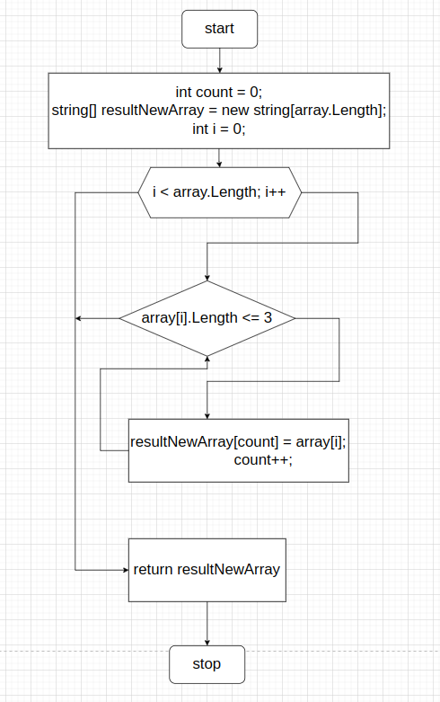

# Итоговая проверочная работа

Написать программу, которая из имеющегося массива строк формирует массив из строк, длинна которых меньше либо равна 3 символа. Первоначальный массив можно ввести с клавиатуры, либо задать на старте выполнения алгоритма. При решении не рекомендуется пользоватся коллекциями, лучше обойтись исключительно массивами.

Примеры:

    ["hello", "2", "world", ":-)"] -> ["2", ":-)"]
    ["1234", "1567", "-2", "computer science"] -> ["-2"]
    ["Russian", "Denmark", "Kazan"] -> []

# Блок схема алгоритма

# Тестовое описание решения

+ Зададим массив строк на старте выполнения программы

+ Проверим элементы массива на 3 символа.
    
  Метод принимает наш массив строк в качестве аргумента,
в теле мотода инициализируем переменную счетчик целочисленного типа.
Так же инициализируем новый массив строк в него будем записывать результат, количество элементов массива равно длинне массива поданного на вход. В цикле сделам перебор элементов массива, пока их количество меньше длинны массива будем увеличивать переменную i на единицу. В теле цикла при условии что текущий элемент массива имеет длинну меньше либо равно трем будем записывать элементы в новый результирующий массив и увеличивать счетчик. 
Количество элементов нового массива равно нашему счетчику.
Когда элементы закончатся происходит выход из цикла, и проверка условия останавливается.
Вернем наш новый результирующий массив по окончанию работы метода.

+ Второй метод выводит массив на экран.

  Метод принимает на вход в качестве аргумента массив строк
в цикле сделам перебор элементов массива, пока их количество меньше длинны массива, будем увеличивать переменную i на единицу.
В теле цикла командой сделаем вывод элементов в консоль в строку через пробел.

+ По итогу.

  Сделаем вывод в консоль исходного массива.
Создадим переменную типа массив строк, в неё запишем результат работы метода проверки массива на длинну символов.
Сделаем вывод в консоль результирующего массива.